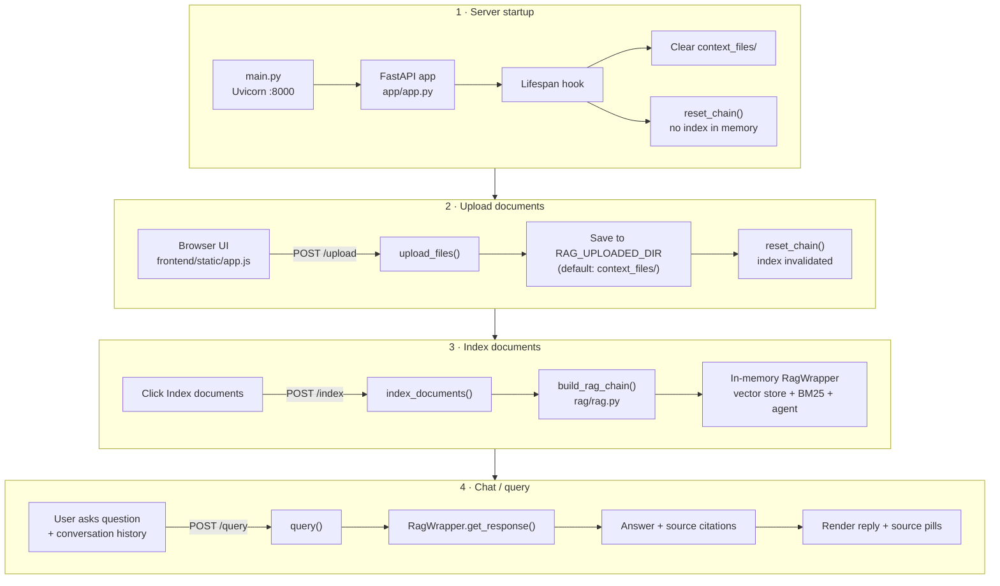
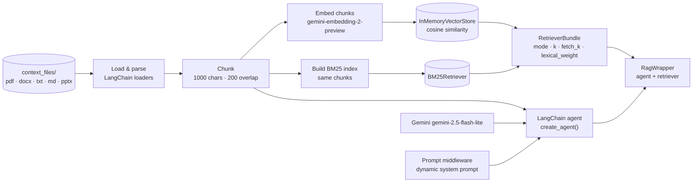
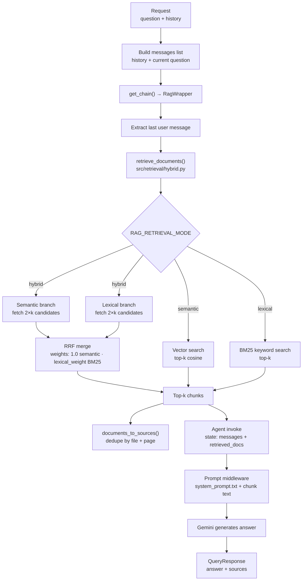

# RAG Chatbot

A local FastAPI application that answers questions over your own documents using Retrieval-Augmented Generation (RAG). Upload files through a browser UI (or the API), ask multi-turn questions, and get answers grounded in retrieved chunks with source citations.

## Features

- **Hybrid retrieval** — dense embeddings (semantic) plus BM25 (lexical), merged with Reciprocal Rank Fusion (RRF) by default.
- **Configurable retrieval** — switch between `semantic`, `lexical`, and `hybrid` modes via environment variables.
- **Multi-turn chat** — the API accepts conversation history so follow-up questions keep context.
- **Source citations** — responses include file names and page numbers for retrieved chunks.
- **Document upload** — index `.docx`, `.pdf`, `.txt`, `.md`, and `.pptx` files.
- **In-memory index** — simple setup for local development and prototyping (no external vector database).

## How it works

### High-level lifecycle



### Indexing pipeline (`POST /index`)



### Query pipeline (each `POST /query`)



### Component map

| Layer | Key files | Role |
| ------ | ----------- | ------ |
| Entry | `main.py` | Starts Uvicorn on port 8000 |
| API | `app/app.py`, `app/schemas.py` | Routes: `/`, `/upload`, `/index`, `/index/status`, `/query`, `/health` |
| Frontend | `frontend/templates/index.html`, `frontend/static/app.js` | Upload UI, index button, multi-turn chat, citation pills |
| RAG core | `rag/rag.py` | Load → chunk → embed → build agent → `RagWrapper` |
| Retrieval | `src/retrieval/hybrid.py` | Semantic / lexical / hybrid (RRF) |
| Prompt | `src/prompt/prompt_manager.py` | Injects retrieved chunks into system prompt |
| LLM | `src/llm/gemini.py` | `gemini-2.5-flash-lite` via LangChain |

### Main steps

1. **Start server** — `python3 main.py`; the upload directory is cleared and no index exists yet.
2. **Upload** — UI or `POST /upload` saves supported files to `context_files/`; any existing index is cleared.
3. **Index** — UI or `POST /index` loads files, chunks them, embeds them, builds BM25 + vector store, and creates the in-memory `RagWrapper`.
4. **Ask** — UI or `POST /query` sends the question plus prior turns (`history` does not include the current question).
5. **Retrieve once** — `RagWrapper` runs hybrid/semantic/lexical retrieval on the latest user message.
6. **Generate** — Retrieved text is injected into the system prompt; the Gemini agent produces the answer.
7. **Respond** — API returns `{ answer, sources }`; the UI shows source pills (file + page).

### Design notes

- **Retrieval runs once per query** in `RagWrapper.get_response()` — the same chunks feed both the LLM prompt and the citation list.
- **Multi-turn chat** — prior turns go in `history`; only the latest user message drives retrieval.
- **Hybrid mode (default)** — semantic and BM25 each fetch up to `2×k` candidates, then RRF merges down to `k` (`RAG_NUMBER_OF_SOURCES`, default 4).
- **Everything is in-memory** — indexes are rebuilt on each `POST /index`; uploads invalidate the index until re-indexing.
- **Strict grounding** — `system_prompt.txt` instructs the model to answer only when confident in the retrieved context.

> Semantic search uses **cosine similarity** over embedding vectors (exact brute-force search in memory). This is appropriate for small corpora; for very large indexes would be better moving to an approximate nearest-neighbor store (e.g. HNSW or IVF in FAISS, Qdrant, or pgvector).

## Project structure

| Path | Role |
| ------ | ------ |
| `main.py` | Entrypoint — runs Uvicorn with reload |
| `app/` | FastAPI routes, request/response schemas, static frontend mount |
| `rag/` | RAG pipeline — document loading, chunking, vector store, chain lifecycle |
| `src/llm/` | LLM provider interface and Gemini implementation |
| `src/prompt/` | Dynamic prompt middleware and `system_prompt.txt` |
| `src/retrieval/` | Hybrid retrieval (semantic, BM25, RRF merge) |
| `frontend/` | HTML template and static UI assets |
| `context_files/` | Uploaded documents used for retrieval (gitignored) |

## Requirements

- Python 3.10+
- A [Google AI API key](https://aistudio.google.com/apikey) with access to Gemini embedding and chat models

## Installation

### Option A: Conda

```bash
conda create -n rag-chatbot python=3.11 -y
conda activate rag-chatbot
pip install -e .
```

### Option B: venv

```bash
python3 -m venv .venv
source .venv/bin/activate
pip install -e .
```

## Configuration

Create a `.env` file at the repository root (or export variables in your shell).

| Variable | Required | Default | Description |
| ---------- | ---------- | --------- | ------------- |
| `GOOGLE_API_KEY` | Yes | — | API key for Gemini embeddings and chat |
| `RAG_UPLOADED_DIR` | No | `context_files/` | Directory for uploaded and indexed documents |
| `RAG_RETRIEVAL_MODE` | No | `hybrid` | `semantic`, `lexical`, or `hybrid` |
| `RAG_LEXICAL_WEIGHT` | No | `0.5` | Weight of the BM25 branch in hybrid RRF merge (semantic branch is `1.0`) |
| `RAG_NUMBER_OF_SOURCES` | No | `4` | Number of chunks to retrieve per query |
| `ENABLE_PRINT_DEBUG` | No | `False` | Log retrieval and message debug output when `true` |

Example `.env`:

```bash
GOOGLE_API_KEY=your_key_here
RAG_UPLOADED_DIR=context_files
RAG_RETRIEVAL_MODE=hybrid
RAG_LEXICAL_WEIGHT=0.5
RAG_NUMBER_OF_SOURCES=4
ENABLE_PRINT_DEBUG=false
```

### Retrieval modes

- **`semantic`** — embedding similarity only (cosine via in-memory vector store)
- **`lexical`** — BM25 keyword search only
- **`hybrid`** — run both, merge ranks with RRF (recommended)

## Run

From the repository root:

```bash
python3 main.py
```

Then open:

- **UI:** [http://127.0.0.1:8000/](http://127.0.0.1:8000/)
- **API docs:** [http://127.0.0.1:8000/docs](http://127.0.0.1:8000/docs)

On startup, the app **clears the upload directory** and resets the in-memory index so each run starts with an empty document set. Upload files again after restarting the server.

## API

### `GET /health`

Returns `{"status": "ok"}`.

### `POST /upload`

Upload one or more files for indexing. Supported extensions: `.docx`, `.pdf`, `.txt`, `.md`, `.pptx`.

**Response:**

```json
{
  "saved": ["report.pdf", "notes.txt"],
  "skipped": ["image.png"]
}
```

Re-uploading clears the current index; call `POST /index` again before querying.

### `GET /index/status`

Returns whether documents are indexed and how many supported files are on disk.

**Response:**

```json
{
  "indexed": true,
  "file_count": 2
}
```

### `POST /index`

Build the in-memory index from uploaded files. Required before querying.

**Response:**

```json
{
  "documents": 2,
  "chunks": 18
}
```

### `POST /query`

Ask a question over the indexed documents.

**Request:**

```json
{
  "question": "What is the refund policy?",
  "history": [
    { "role": "user", "content": "Tell me about billing." },
    { "role": "assistant", "content": "Billing is handled monthly..." }
  ]
}
```

`history` contains prior turns in order and does **not** include the current `question`.

**Response:**

```json
{
  "answer": "Refunds are available within 30 days...",
  "sources": [
    { "file": "policy.pdf", "path": "/path/to/context_files/policy.pdf", "page": 3 }
  ]
}
```

## Typical workflow

1. Start the server: `python3 main.py`
2. Open [http://127.0.0.1:8000/](http://127.0.0.1:8000/)
3. Upload documents in the UI (or call `POST /upload`)
4. Click **Index documents** (or call `POST /index`)
5. Ask questions in the chat UI or via `POST /query`
6. Inspect source pills under each assistant reply

## Limitations

- **In-memory only** — the vector store and BM25 index live in process memory and are rebuilt when you call `POST /index` (or after new uploads, until you re-index). Not suitable for large production corpora without swapping in a persistent vector database.
- **Exact vector search** — no HNSW/IVF indexing; every query compares against all chunk embeddings. Fast enough for small document sets.
- **Fresh start on boot** — `context_files/` is emptied when the server starts; persist files elsewhere if you need them across restarts.
- **Single-provider LLM** — defaults to Gemini via `langchain-google-genai`; other providers can be wired through `src/llm/base.py`.

## Troubleshooting

### The chatbot does not find the relevant documentation

The system prompt is very strict and mandates the llm to answer only when it's 100% sure. In Hybrid mode, **the problem could come from how the retrieved sources are ranked, scored, and merged**. If the query mentions a very specfic keyword, the lexical branch would probably have the better passages, but they might get ignored after narrowing down the final number of sources during RRF for two main reasons:

- The semantic branch is set to prevail by default over the lexical one during RRF, because `RAG_LEXICAL_WEIGHT=0.5`.
- The number of sources in `RAG_NUMBER_OF_SOURCES` is too low, and the relevant information is ranked poorly, but close to the `RAG_NUMBER_OF_SOURCES`, so they are ignored.

#### Practical fixes

- Raise `RAG_NUMBER_OF_SOURCES` so poorly runked, but relevant chunks can enter the pool.
- Raise `RAG_LEXICAL_WEIGHT` (e.g. 1.0 or higher) so BM25 matches for proper names compete fairly in RRF.
- Retrieve more per branch before merging (e.g. 2k or 3k from each, then RRF down to k).
- Detect keyword names in the query and boost lexical-only or filter chunks containing those tokens. This could be done depending on the keyword topic, and providing a curated list of those entities.
