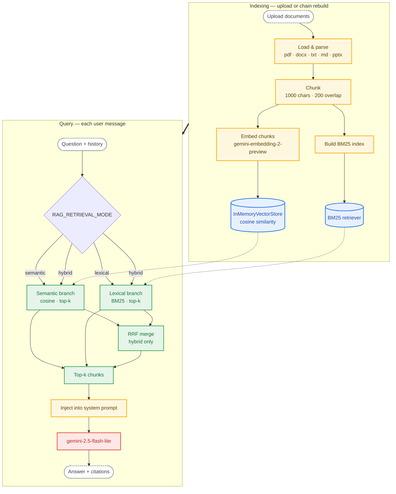

# RAG Chatbot

A local FastAPI application that answers questions over your own documents using Retrieval-Augmented Generation (RAG). Upload files through a browser UI (or the API), ask multi-turn questions, and get answers grounded in retrieved chunks with source citations.

## Features

- **Hybrid retrieval** — dense embeddings (semantic) plus BM25 (lexical), merged with Reciprocal Rank Fusion (RRF) by default.
- **Configurable retrieval** — switch between `semantic`, `lexical`, and `hybrid` modes via environment variables.
- **Multi-turn chat** — the API accepts conversation history so follow-up questions keep context.
- **Source citations** — responses include file names and page numbers for retrieved chunks.
- **Document upload** — index `.docx`, `.pdf`, `.txt`, `.md`, and `.pptx` files.
- **In-memory index** — simple setup for local development and prototyping (no external vector database).

## How it works



1. **Indexing** — Documents under `context_files/` are loaded, split into overlapping chunks, embedded with `gemini-embedding-2-preview`, and stored in LangChain’s `InMemoryVectorStore`. A BM25 index is built over the same chunks for keyword search.
2. **Retrieval** — On each user message, the pipeline retrieves up to `k` chunks (default 4, but configurable through an environment variable). In hybrid mode, semantic and lexical ranked lists are fused with RRF so scores from cosine similarity and BM25 do not need to be normalized against each other.
3. **Generation** — Retrieved text is appended to the system prompt. A LangChain agent (using Gemini `gemini-2.5-flash-lite`) generates the answer. The same retrieval path feeds both the prompt and the citation list returned to the client.

> Semantic search uses **cosine similarity** over embedding vectors (exact brute-force search in memory). This is appropriate for small corpora; for very large indexes would be better moving to an approximate nearest-neighbor store (e.g. HNSW or IVF in FAISS, Qdrant, or pgvector).

## Project structure

| Path | Role |
| ------ | ------ |
| `main.py` | Entrypoint — runs Uvicorn with reload |
| `app/` | FastAPI routes, request/response schemas, static frontend mount |
| `rag/` | RAG pipeline — document loading, chunking, vector store, chain lifecycle |
| `src/llm/` | LLM provider interface and Gemini implementation |
| `src/prompt/` | Dynamic prompt middleware and `system_prompt.txt` |
| `src/retrieval/` | Hybrid retrieval (semantic, BM25, RRF merge) |
| `frontend/` | HTML template and static UI assets |
| `context_files/` | Uploaded documents used for retrieval (gitignored) |

## Requirements

- Python 3.10+
- A [Google AI API key](https://aistudio.google.com/apikey) with access to Gemini embedding and chat models

## Installation

### Option A: Conda

```bash
conda create -n rag-chatbot python=3.11 -y
conda activate rag-chatbot
pip install -e .
```

### Option B: venv

```bash
python3 -m venv .venv
source .venv/bin/activate
pip install -e .
```

## Configuration

Create a `.env` file at the repository root (or export variables in your shell).

| Variable | Required | Default | Description |
| ---------- | ---------- | --------- | ------------- |
| `GOOGLE_API_KEY` | Yes | — | API key for Gemini embeddings and chat |
| `RAG_UPLOADED_DIR` | No | `context_files/` | Directory for uploaded and indexed documents |
| `RAG_RETRIEVAL_MODE` | No | `hybrid` | `semantic`, `lexical`, or `hybrid` |
| `RAG_LEXICAL_WEIGHT` | No | `0.5` | Weight of the BM25 branch in hybrid RRF merge (semantic branch is `1.0`) |
| `RAG_NUMBER_OF_SOURCES` | No | `4` | Number of chunks to retrieve per query |
| `ENABLE_PRINT_DEBUG` | No | `False` | Log retrieval and message debug output when `true` |

Example `.env`:

```bash
GOOGLE_API_KEY=your_key_here
RAG_UPLOADED_DIR=context_files
RAG_RETRIEVAL_MODE=hybrid
RAG_LEXICAL_WEIGHT=0.5
RAG_NUMBER_OF_SOURCES=4
ENABLE_PRINT_DEBUG=false
```

### Retrieval modes

- **`semantic`** — embedding similarity only (cosine via in-memory vector store)
- **`lexical`** — BM25 keyword search only
- **`hybrid`** — run both, merge ranks with RRF (recommended)

## Run

From the repository root:

```bash
python3 main.py
```

Then open:

- **UI:** [http://127.0.0.1:8000/](http://127.0.0.1:8000/)
- **API docs:** [http://127.0.0.1:8000/docs](http://127.0.0.1:8000/docs)

On startup, the app **clears the upload directory** and resets the in-memory index so each run starts with an empty document set. Upload files again after restarting the server.

## API

### `GET /health`

Returns `{"status": "ok"}`.

### `POST /upload`

Upload one or more files for indexing. Supported extensions: `.docx`, `.pdf`, `.txt`, `.md`, `.pptx`.

**Response:**

```json
{
  "saved": ["report.pdf", "notes.txt"],
  "skipped": ["image.png"]
}
```

Re-uploading triggers a rebuild of the in-memory index on the next query.

### `POST /query`

Ask a question over the indexed documents.

**Request:**

```json
{
  "question": "What is the refund policy?",
  "history": [
    { "role": "user", "content": "Tell me about billing." },
    { "role": "assistant", "content": "Billing is handled monthly..." }
  ]
}
```

`history` contains prior turns in order and does **not** include the current `question`.

**Response:**

```json
{
  "answer": "Refunds are available within 30 days...",
  "sources": [
    { "file": "policy.pdf", "path": "/path/to/context_files/policy.pdf", "page": 3 }
  ]
}
```

## Typical workflow

1. Start the server: `python3 main.py`
2. Open [http://127.0.0.1:8000/](http://127.0.0.1:8000/)
3. Upload documents in the UI (or call `POST /upload`)
4. Ask questions in the chat UI or via `POST /query`
5. Inspect source pills under each assistant reply

## Limitations

- **In-memory only** — the vector store and BM25 index live in process memory and are rebuilt when the chain is reset (upload, server restart). Not suitable for large production corpora without swapping in a persistent vector database.
- **Exact vector search** — no HNSW/IVF indexing; every query compares against all chunk embeddings. Fast enough for small document sets.
- **Fresh start on boot** — `context_files/` is emptied when the server starts; persist files elsewhere if you need them across restarts.
- **Single-provider LLM** — defaults to Gemini via `langchain-google-genai`; other providers can be wired through `src/llm/base.py`.
